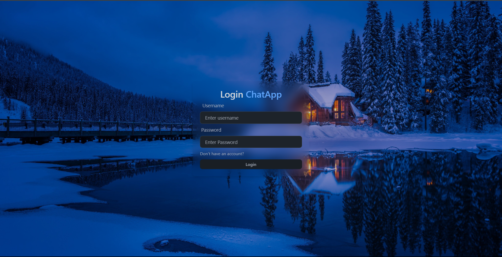
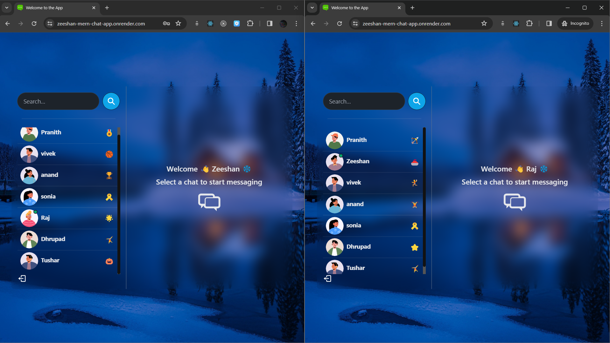
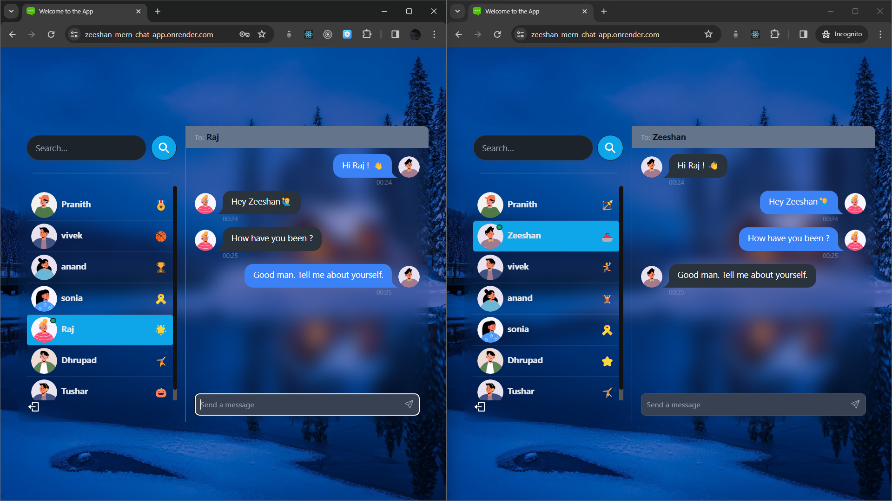

# MERN Chat Application

A real-time chat application built using the MERN (MongoDB, Express, React, Node.js) stack along with Socket.IO for enabling real-time messaging.

## Features

- **Real-Time Chat:** Instant messaging functionality allows users to exchange messages in real time.
- **Protected Routes:** JWT authentication secures routes, ensuring only authenticated users can access the chat features.
- **JWT Authentication:** JSON Web Token (JWT) authentication is implemented for user authentication and authorization.
- **Learning Socket.IO:** Developed with the main purpose of learning Socket.IO, gaining insights into real-time communication and event-based programming.

## Technologies Used

- MongoDB
- Express.js
- React.js
- Node.js
- Socket.IO

## Deployment

The application is deployed on [Render](https://zeeshan-mern-chat-app.onrender.com).

## Installation

To run this application locally, follow these steps:

1. Clone the repository: `git clone https://github.com/Zeeshan251/mern-chat-app.git`
2. Navigate to the project directory: `cd mern-chat-app`
3. Install dependencies: `npm install`
4. Start the server: `npm start`

## Contributing

Contributions are welcome! Please feel free to open a pull request or submit an issue if you find a bug or want to propose a new feature.

## License

This project is licensed under the [MIT License](LICENSE).

